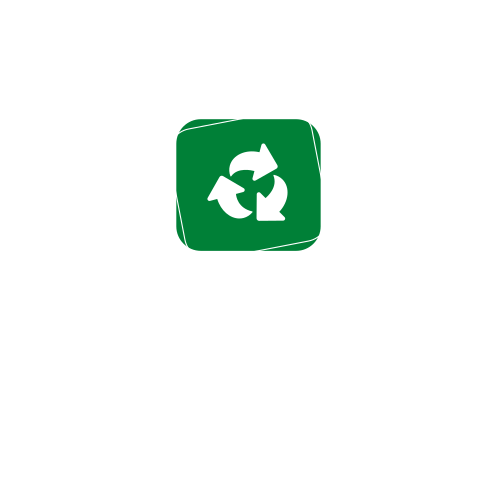
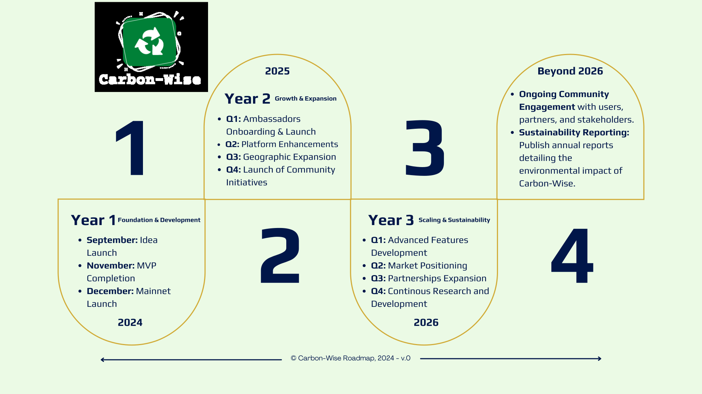

# Carbon-Wise Smart Contract Documentation

## Overview

**Carbon-Wise** is a cutting-edge blockchain-powered platform designed to address two major global challenges: plastic waste and climate change. By transforming plastic waste recycling into tradeable carbon credits, Carbon-Wise offers a unique solution that incentivizes responsible waste disposal while contributing to global climate action. With a transparent and secure platform powered by blockchain, we’re helping users make a measurable difference in the fight against climate change, while also benefiting from the growing carbon market. Every recycled bottle not only reduces plastic waste but also contributes to significant CO₂ savings.

Let’s turn waste into wealth—and carbon reductions. Let’s build a sustainable future with **Carbon-Wise**.

## The Platform: Carbon-Wise

**Carbon-Wise** tokenizes real-world assets (recycled plastic) to create a transparent and verifiable market for carbon credits. Our platform enables users to deposit plastic waste at designated collection points in exchange for Deposit Tokens, which can be spent in the marketplace. The collected plastics are then sent to recycling facilities where they are processed and converted into verifiable carbon credits.

## Contracts

The Carbon-Wise is a comprehensive blockchain-based solution comprising three core contracts: `Carbon-Wise`, `RCarbon-Wise`, and `MarketPlace`. This integrated system is designed to promote environmental sustainability by rewarding users for recycling efforts through the issuance of receipt tokens (RWISE) and enabling the trade of items in a marketplace.

### Carbon-Wise

- **Name**: Carbon-Wise
- **License**: UNLICENSED
- **Solidity Version**: ^0.8.13

**Carbon-Wise** is a smart contract that manages user recycling information and rewards users for their recycling activities. Users can create accounts, record recycling transactions, and earn tokens for their efforts.

### RCarbon-Wise

- **Name**: RCarbon-Wise
- **License**: MIT
- **Solidity Version**: >=0.7.0 <0.9.0

**RCarbon-Wise** is the Receipt token contract used within the Carbon-Wise. It allows the minting and burning of receipt tokens and serves as a reward for users who deposit pet bottles.

### MarketPlace

- **Name**: MarketPlace
- **License**: MIT
- **Solidity Version**: >=0.7.0 <0.9.0

**MarketPlace** is a smart contract for managing item listings in a marketplace. Users can create listings, update item information, perform transactions, and redeem receipt tokens.

## Core Functionality

### User Account Management (Carbon-Wise)

- Users can create accounts with personal information.
- Recycling transactions are recorded, and users earn tokens.
- Users can edit their information.
- User data is stored in a structured format.

### Receipt Token Management (RCarbon-Wise)

- Token contract to mint and burn receipt tokens.
- Users receive tokens as rewards for recycling efforts.

### Item Listing Management (MarketPlace)

- Users can create item listings in the marketplace.
- Items can be updated with new information.
- Users can perform transactions in the marketplace.
- Placeholder functions for redeeming receipt tokens.

## Data Structures

- **User Structure (Carbon-Wise)**: Represents user information.
- **Gender Enumeration (Carbon-Wise)**: Enumerates user gender.
- **Recycled Structure (Carbon-Wise)**: Represents recycling transactions.
- **ItemInfo Structure (MarketPlace)**: Stores item listing information.

## State Variables

- **Carbon-Wise**: Stores user data and recycling transactions.
- **RCarbon-Wise**: Manages receipt tokens.
- **MarketPlace**: Manages item listings and transactions.

## Custom Errors

- Custom errors are defined to handle specific situations, such as account creation, token minting, and transaction issues.

## Usage

The Carbon-Wise smart contract system is designed to create a sustainable ecosystem where users are rewarded for recycling and can trade items in a marketplace. Users can create accounts, record recycling transactions, manage receipt tokens, and participate in the marketplace. The system encourages environmental sustainability and promotes recycling practices.

## License

The smart contracts are released under the UNLICENSED and MIT licenses, allowing for open use, modification, and distribution. However, ensure a clear understanding of the code and its functionality before deploying it in a production environment.

## Deployed Contract Addresses on Lisk Sepolia

USDToken - 0xd13D1fEbB1c1B4cD2d331494eD6C709Ea454d576

CarbonWise - 0xDaE55bE15252510f66c629198A2dE181Ca2A0537

EventMarketPlace - 0x19Ebea8A04476F2d4f8734bd31eC26403d057702

CcMarketPlace - 0x6Eb37b2f0B5C9cA138E706815734cccf854c0e34
